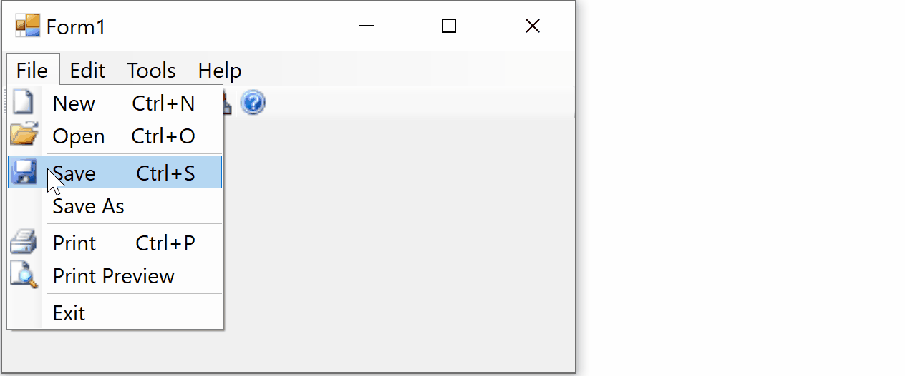

# CustomizeToolStripToolTip

This example shows hows to customize the ToolTip of ToolStrip, MenuStrip, ContextMenuStrip, or anything deriving from ToolStrip.

ToolStrip has an internal ToolTip property that you can find using reflection, and then treat it like any normal tooltip, for example you can set its forecolor, backcolor, or change the font and size of it and have a custom logic for drawing the tooltip.

The usage of the method is easy, just pass the MenuStrip or ToolStrip instance to it:

    SetupCustomDraw(MenuStrip1)

It will apply the customization on tooltip of all menu items and sub menus of the givem menu. You should also make sure the ShowToolTip property of the ToolStrip or MenuStrip is True.

There you go!

Look at the following customization; it's a tooltip with White text, Red backcolor, and twice size/font as normal:

